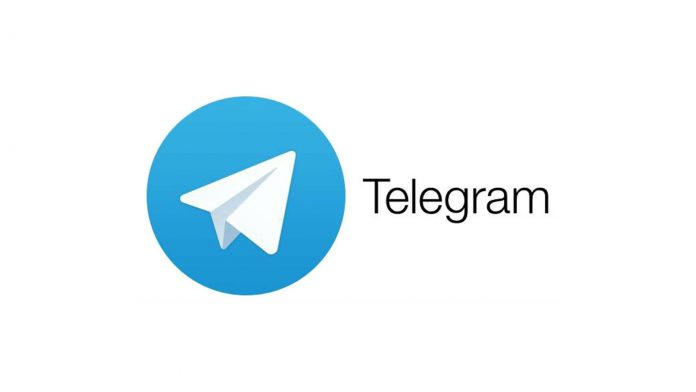

# Telegram desktop client in a container



Telegram is a cloud-based instant messaging and voice over IP service developed
by Telegram Messenger LLP, a privately held company registered in London, United
Kingdom, founded by the Russian entrepreneur Pavel Durov and his brother
Nikolai.

# Run this image

Just create the function bellow and call it.

```
#!/bin/bash

function telegram() {
    xhost local:root 
    docker run --rm -it --name telegram \
    --cpuset-cpus 1 \
    --device /dev/snd \
    -e DISPLAY \
    -v /etc/localtime:/etc/localtime:ro \
    -v /tmp/.X11-unix:/tmp/.X11-unix \
    -v $HOME/.TelegramDesktop:/root/.local/share/TelegramDesktop/ \
    -v $HOME/Downloads:/root/Downloads \
    -v $HOME/Pictures:/root/Pictures \
    strm/telegram
}
```
